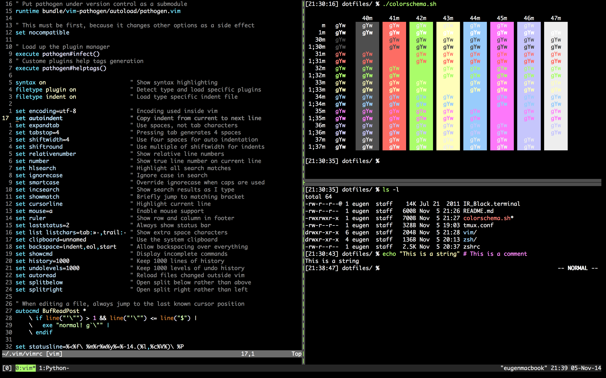

# Dotfiles

My dotfile repository. This is the configuration of a vim, zshell,
and tmux setup for OS X. All plugins and extensions for vim and zsh are
included as submodules, so any updates to these can be managed with git
as well:

`git submodule foreach git pull origin master`

The configuration centers mostly on vim and zsh. The tmux setup is not
optimal yet.



Vi mode in zsh is the standard input line mode.
Keybindings need to be improved.

## Prerequisites

Install this first:

`vim zsh tmux tree curl git ipython`

## Installation Instructions

Starting with vim 7.4 the configuration file can be placed in `~/.vim/vimrc`.

```bash
git clone --recursive https://github.com/ekammerloher/dotfiles.git ~/dotfiles
ln -s ~/dotfiles/vim ~/.vim
ln -s ~/dotfiles/zsh ~/.zsh
ln -s ~/dotfiles/zshrc ~/.zshrc
ln -s ~/dotfiles/tmux.conf ~/.tmux.conf
```

`IR_Black.terminal` is a theme for the OS X Terminal.app.
