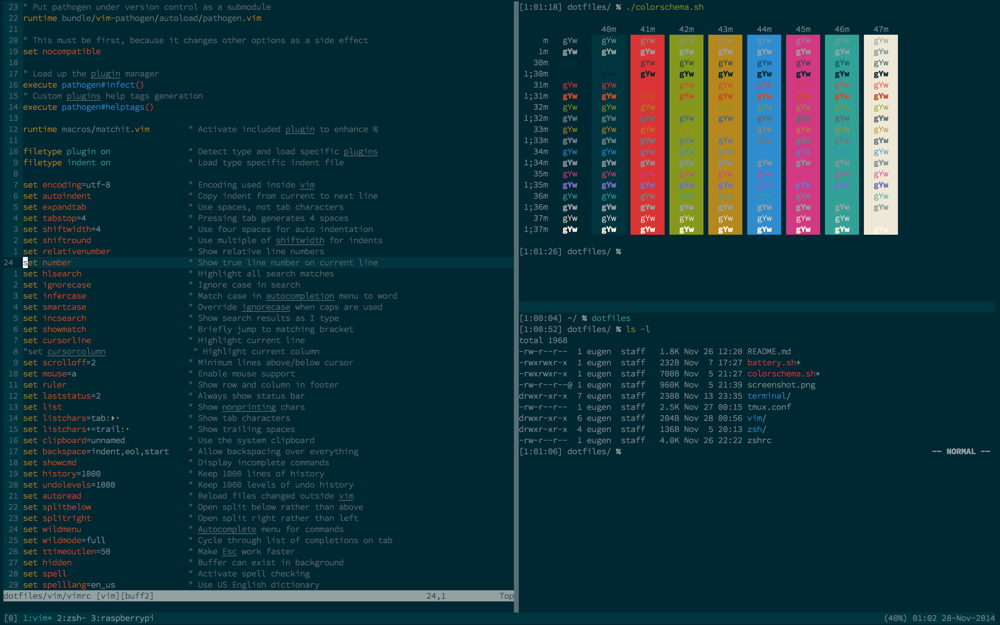

# Dotfiles

My dotfile repository. This is the configuration of a vim, zshell,
and tmux setup for OS X. All plugins and extensions for vim and zsh are
included as submodules, so any updates to these can be managed with git
as well:

`git submodule foreach git pull origin master`

The configuration centers mostly on vim and zsh. The tmux setup is not
optimal yet.


This is an old screenshot!

Vi mode in zsh is the standard input line mode.
Keybindings need to be extended.

## Prerequisites

Install this first:

`vim zsh tmux tree curl git ipython ctags`

On a OS X system use macports and select:

`vim +huge+python`

The package `tmux-pasteboard` is necessary as well to configure copy/paste
into/from tmux.

On OS X the package `ctags` conflicts with the XCode version.
The `PATH` variable has to be correct. Additionally this command is necessary:

`sudo chmod ugo-x /usr/libexec/path_helper`

as suggested [here](https://github.com/dotphiles/dotzsh#mac-os-x).

## Installation Instructions

Starting with vim 7.4 the configuration file can be placed in `~/.vim/vimrc`.

```bash
git clone --recursive https://github.com/ekammerloher/dotfiles.git ~/dotfiles
ln -s ~/dotfiles/vim ~/.vim
ln -s ~/dotfiles/zsh ~/.zsh
ln -s ~/dotfiles/zshrc ~/.zshrc
ln -s ~/dotfiles/tmux.conf ~/.tmux.conf
```

Install iTerm2.app and add the colorscheme Solarized from `terminal/`.
Default is Solarized dark.
Install the Source Code Pro fonts from `terminal/fonts` with Font Book.app.
Set the font in iTerm2.app with 12pt. Regular or Light are good.

## Why iTerm2?

* iTerm2 can use the colorscheme without patches unlike the default terminal
emulator.
* The mouse cursor is hidden automatically on text entry and
is not in the way.
* The text cursor is intelligent and changes color to match the background.
